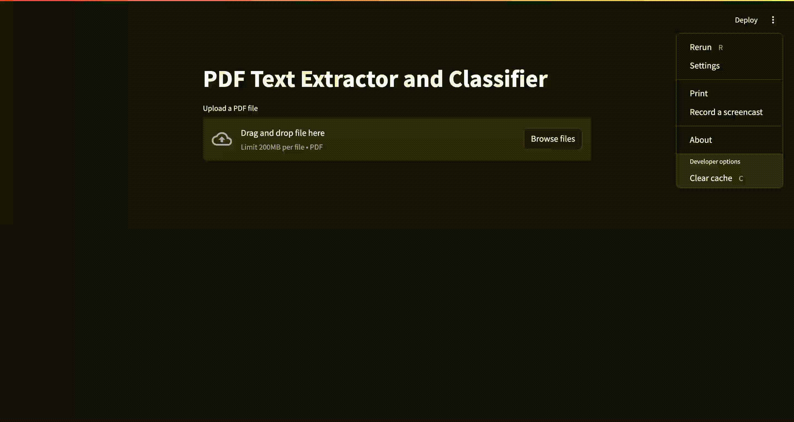

# PDF Text Extractor and Classifier

This project is a Streamlit application that extracts text from PDF files and classifies the content using a BERT-based model.




## Prerequisites

Before running the application, make sure you have the following installed:

- Python 3.10+
- pip (Python package installer)

## Installation

1. Clone this repository:

   ```
   git clone https://github.com/your-username/parspec-assignment.git
   cd parspec-assignment
   ```

2. Install the required packages:

   ```
   pip install -r requirements.txt
   ```

3. Download the pre-trained model:
   Make sure you have the [bert-base-parspec](https://drive.google.com/drive/folders/1ALkv9QXxyKsWyoB24-X-iK6cQqzSl9I5?usp=drive_link) directory in the project root. If not, you may need to download it separately or train the model.

## Usage

To run the Streamlit app:

1. Open a terminal and navigate to the project directory.

2. Run the following command:

   ```
   streamlit run app.py
   ```

3. Open a web browser and go to the URL displayed in the terminal (usually `http://localhost:8501`).

4. Use the app interface to upload a PDF file and classify its content.

## Features

- Upload PDF files
- Extract text from PDF files
- Classify the extracted text into predefined categories (cable, fuses, lighting, others)
- Display classification results with probabilities

## Note

Ensure that the `MODEL_DIR` and `TOKENIZER` variables in `app.py` are set correctly to point to your model and tokenizer locations.
